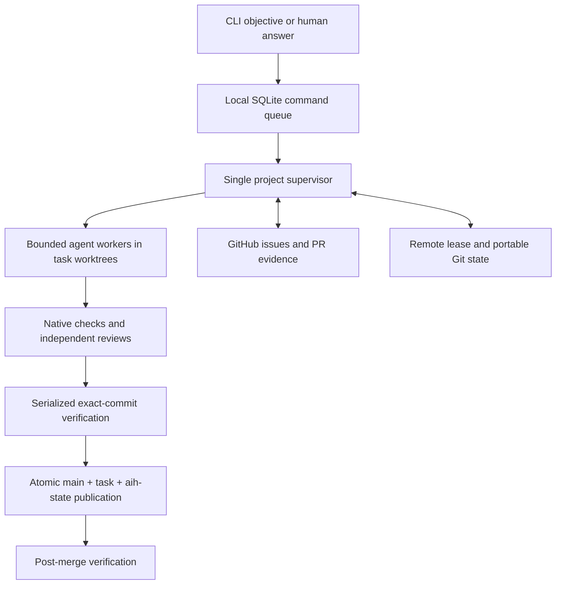

# AI Agentic Harness (AIH)

AIH is a local control plane for **Codex CLI** and **Claude Code**. Give it a
software-development objective: it plans a task graph, creates GitHub issues,
runs bounded workers in separate Git worktrees, tests and reviews changes, and
integrates verified work. Decisions requiring a person appear in a task inbox.

It is one Go executable, not a model, web application, or hosted service. It can
run on your development machine or continuously on an Ubuntu VM. GitHub holds
portable checkpoints; SQLite holds each machine's command queue and cache.

**Status:** functional V1 with Linux deployment tooling. Use trusted,
non-production repositories for your first trial. See [validation and remaining
limits](docs/VALIDATION.md). MIT licensed. No GitHub Actions or paid GitHub tier
is required; model usage and your VM can still cost money.

## Quick start

There are **two repositories**: this harness, which you install, and your
application, which AIH will modify. Do not run `aih init` in this repository
unless you intentionally want AIH to work on itself.

### 1. Build and try the harness

Prerequisites: Git **2.28+** and a Go **1.21+ bootstrap installation** with automatic
toolchain selection enabled. `go.mod` pins the actual build toolchain (currently
Go 1.27.1; module minimum 1.26). Setup downloads that toolchain and checksummed
Go modules. The compiled binary needs neither Go nor a separate SQLite server.

Linux/macOS:

```sh
git clone https://github.com/nvrakesh06/ai-agentic-harness.git
cd ai-agentic-harness
./scripts/setup.sh
cp .env.example .env
chmod 600 .env
./bin/aih demo
sh scripts/install.sh --source ./bin/aih
export PATH="$HOME/.local/bin:$PATH"
```

Windows PowerShell:

```powershell
git clone https://github.com/nvrakesh06/ai-agentic-harness.git
cd ai-agentic-harness
.\scripts\setup.ps1
Copy-Item .env.example .env
.\bin\aih.exe demo
.\scripts\install.ps1 -Source .\bin\aih.exe
$env:PATH = "$env:LOCALAPPDATA\Programs\AIH;$env:PATH"
```

The demo uses real local Git/SQLite and fake providers/GitHub: **no credentials,
model calls, or GitHub writes**. It completes three tasks, preserves a human
blocker, deletes its disposable machine-A project, and reconstructs on machine B.
Other demo artifacts are retained at the printed temporary path.

Setup does not install agent CLIs, authenticate, use sudo, or change Git identity.
Ubuntu prerequisites and the full server path are in [VM setup](docs/VM_SETUP.md).

### 2. Authenticate GitHub and one agent

Install [GitHub CLI](https://cli.github.com/), then:

```sh
gh auth login --hostname github.com --git-protocol https --web
gh auth setup-git
```

`setup-git` intentionally configures the current OS user's Git credential helper.
On a headless VM, open the displayed GitHub URL/code in a browser on another
device. Install **one** provider using [agent setup](docs/AGENTS_SETUP.md):

```sh
codex login --device-auth        # or codex login on a desktop
# Alternative provider: claude auth login
aih --env-file .env doctor --machine --provider codex
```

The environment file is optional and **never auto-loaded**. Pass `--env-file`
explicitly when using it; otherwise AIH uses the process environment and defaults.
There is no mandatory AIH API key. Doctor makes no model calls and prints no
authentication output. Authenticate as the same OS user that will run AIH.

### 3. Enable your application

Use a trusted GitHub application with a pushed `origin/main`, issues enabled,
and write permission for the authenticated account. Clone it separately:

The commands below use defaults. If you customized the harness `.env`, keep
passing `aih --env-file /ABSOLUTE/PATH/TO/THAT/.env ...` after changing directories;
AIH does not discover the previous checkout's file automatically.

```sh
git clone https://github.com/YOUR_OWNER/YOUR_APPLICATION.git
cd YOUR_APPLICATION
aih init --provider codex        # or --provider claude-code
# Review .aih/project.yaml checks and add project-specific guidance to AGENTS.md.
git add .aih AGENTS.md
git commit -m "Enable AIH"
git push origin main
aih doctor
aih run "Implement a small feature with tests"
aih watch
```

Set your own Git author in this application if needed, using `git config user.name`
and `git config user.email`. AIH's own commits use the neutral `AIH <aih@localhost>`
identity without changing global Git settings. [GitHub setup](docs/GITHUB_SETUP.md)
explains permission, SSH, and protected-branch considerations.

Review generated checks before starting. At least one must apply to your OS.
Application build tools and dependencies must be available in **every new task
worktree**, not just the original clone. Configure a trusted check/bootstrap script
that performs reproducible installation if needed; see [configuration](docs/DEVELOPMENT.md).

For an already-enabled application use `aih attach`, **not** `aih init`, then
`aih resume`. Neither command overrides another machine's live lease.

## Start, stop, and inspect

Run these in the application, or add `--repo /path/to/application`:

```sh
aih start                       # detached local supervisor
aih start --foreground          # terminal, tmux, or process manager
aih run --file requirement.md    # queues work and ensures a supervisor exists
aih status                      # cached tasks, lease, local process status
aih blockers
aih answer TASK_ID "Use the existing API contract"
aih logs                        # recent durable events and diagnostic paths
aih stop                        # stop workers, checkpoint, release ownership
aih handoff                     # same orderly shutdown for a machine switch
aih resume
```

With systemd, use `systemctl --user start/stop/restart aih-my-app` to manage the
service. Keep it running before submitting objectives. `run`/`answer` can start a
detached supervisor if no service is active; do not accidentally run two process
managers for one project. [VM setup](docs/VM_SETUP.md) covers boot and SSH independence.

## Configuration

| Setting | Source | Purpose |
| --- | --- | --- |
| Project provider, checks, concurrency, model tiers | `.aih/project.yaml` on application `main` | Shared execution policy |
| Retry budgets / runtime compatibility | `.aih/policies.yaml`, `.aih/harness.lock` on `main` | Recovery and version rules |
| Instructions / specialists | `AGENTS.md`, `.aih/roles/`, `.aih/platform/` on `main` | Canonical agent context |
| Application checkout | `--repo` (default current directory) | CLI target |
| Machine state | `--home` > `AIH_HOME` > OS home `/.aih` | Persistent local disk, outside source |
| Agent executable | `CODEX_BINARY`, `CLAUDE_BINARY` | PATH name or full path; no embedded flags |
| Optional environment file | `--env-file PATH` | Literal `KEY=VALUE`; process values take precedence |
| Release upstream | `AIH_RELEASE_REPO` | Fork override for release checks, installers and staged updates |
| Project update notifications | `release_repo` on application `main` | Used when `AIH_RELEASE_REPO` is unset; self-update uses the environment/upstream |

Use absolute paths in machine configuration. Environment files do not expand
`~`, `$HOME`, other variables, or shell expressions. `KEY="value with spaces"` is
supported; inline comments and multiline values are not. Protect real files with
mode `0600` on Unix or your user ACL on Windows. Never commit credentials.

One provider is selected per project. Both integrations are non-interactive,
disposable processes with strict results and timeouts; no permanent interactive
terminal or laptop session is needed. Optional `provider_models` maps capability
tiers to model IDs; otherwise the provider's defaults apply.

## How it works



One local lock plus a remotely fenced lease prevents cooperating controllers from
publishing concurrently. SQLite uses WAL and FULL synchronization. After a crash,
interrupted workers are marked interrupted and eligible tasks are rechecked or
resumed from retained worktrees/checkpoints. Lost disks lose unpushed edits and
queued-only commands, not acknowledged remote state. [Recovery details](docs/RECOVERY.md).

Implementation workers use a fixed soft deadline at 80 percent of their configured
budget. Active work gets one checkpoint/finalizer pass inside the remaining hard
budget. If that pass times out, AIH checkpoints safe edits and passes a synthetic,
evidence-backed handoff to the next worker; it never extends the hard deadline again.

There is no HTTP API, management port, browser dashboard, Redis, or external queue.
See [architecture](docs/ARCHITECTURE.md), [state layout](docs/STATE.md),
[integration decision](docs/DECISIONS.md), and [custom roles](docs/ROLES.md).

## Security and limitations

AIH intentionally executes powerful tools and repository-controlled checks as its
OS user. Codex can execute shell commands under its provider sandbox; Claude has
an explicit read/edit tool list without a shell tool. **Native checks are
unrestricted OS processes.** This is not hostile-code isolation. Use a dedicated,
non-root account/VM without production credentials. Read [SECURITY.md](SECURITY.md).

V1 supports GitHub.com and `main`, one provider per project, at most three writers,
and at least one OS-applicable native check. It does not provision application
services, initialize submodules/LFS, sandbox malicious repositories, deploy to
production, rotate credentials, or automatically revert failed integrations.
Post-merge failures hold further integration for a human decision.

Snapshots, completed worktrees, sessions, and events accumulate; monitor disk and
follow the [retention runbook](docs/VM_SETUP.md#storage-logs-and-backups).
Network/provider outages and expired credentials still require attention.
macOS and Linux arm64 cross-builds are not claims of native validation.

## Development and troubleshooting

```sh
go test ./... -timeout 6m
go run ./cmd/checkfmt           # formatting lint, also on Windows
go vet ./...                   # static analysis
go build ./cmd/aih             # compilation includes Go type checking
go run ./cmd/release           # tests, vet, five cross-builds, SHA256SUMS
```

There is no frontend lint/typecheck toolchain. Tests use mock external services,
not paid models. On Linux with GCC: `go test -race ./... -timeout 10m`.

| Symptom | First action |
| --- | --- |
| Missing agent / unsupported flags | Install/update it; set its binary override; rerun doctor |
| CLI works in SSH but not as service | Check service user, captured PATH, environment path and credential store |
| Live lease after crash | Wait lease duration plus five seconds; systemd retries without stealing ownership |
| No canonical configuration | Commit/push `.aih` and `AGENTS.md` to application `main` |
| Push / integration rejected | Check Git credentials and repository rules; protections are never bypassed |
| Check tool / dependencies missing | Configure tools and per-worktree dependency installation |
| Ownership / safe.directory error | Correct checkout ownership; never use `safe.directory=*` |
| State looks stale | `status` is cached; inspect supervisor logs, heartbeat and network access |

Layout: `cmd/` entry points; `internal/engine` orchestration; `provider`, `platform`,
`gitx`, `github`, `store` adapters; `model`, `config`, `roles`, `safety` policy/data;
`service` unit rendering; `scripts/` setup/install; `docs/` runbooks.

See [CONTRIBUTING.md](CONTRIBUTING.md), [development/configuration](docs/DEVELOPMENT.md),
[agent setup](docs/AGENTS_SETUP.md), [VM setup](docs/VM_SETUP.md),
[releases](docs/RELEASES.md), and [validation](docs/VALIDATION.md).
