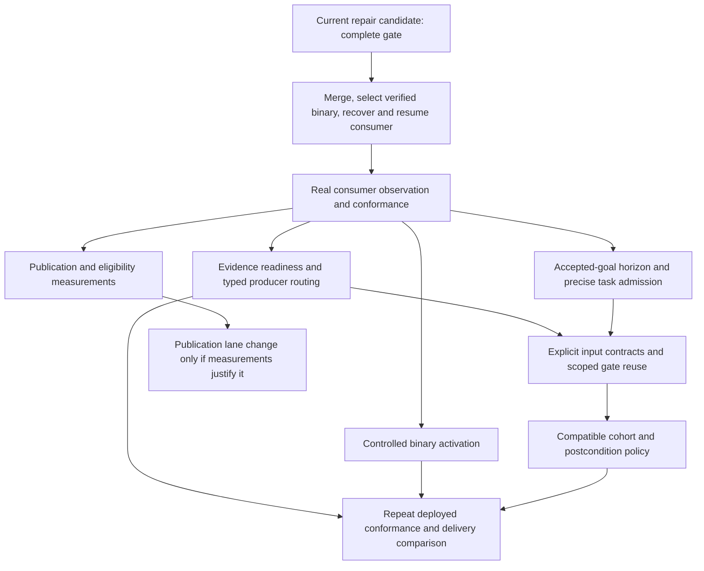

# AIH execution architecture: continuous delivery from accepted goals

Status: proposed execution-policy revision, 2026-09-26. This document describes
AIH, not StatMotion's product architecture. It distinguishes implemented
mechanisms, candidate repairs, and work still required. Passing a source test or
writing this plan does not establish that a consumer delivers faster.

## Outcome and retained architecture

AIH should perform the recurring decisions of an attentive human coordinator:
prepare the next useful work, admit independent writers, provide acceptance
evidence, direct a failure to its owner, integrate verified work, and continue
without the user reminding it to fill slots. Success is completed accepted
deliverables and shorter critical-path delay, not role calls or open PR counts.

Retain the single Go supervisor, deterministic scheduler, existing planner and
provider adapters, isolated worktrees, local SQLite, portable `aih-state`, resource
permits, and fenced merge train. Extend their contracts rather than add another
dispatcher, agent framework, queue service, or product-specific orchestration.
The supervisor remains the sole publisher. Git/source and portable state retain
their atomic compare-and-swap transaction and cross-machine recovery properties.

The architectural change is from a task pipeline that can wait at each gate to
an explicit delivery loop that prepares and explains the next bounded action.
Existing acceptance obligations remain in force during rollout.

## Evidence behind the revision

The stopped StatMotion snapshot at revision 4894 has 21 tasks: 10 DONE, 8 READY,
2 REVIEW, and 1 BLOCKED_HUMAN. It has seven already-planned accepted objectives.
READY is not necessarily runnable: unfinished dependencies and preflight can
exclude admission. Two configured writers alone cannot fix this.

Renderer task #6 recorded 151 provider invocations: 34 implementer, 116 specialist,
and one Advisor. Recorded duration totals 44,590 provider seconds, of which 28,923
are specialist work. These overlapping totals are not elapsed delivery time or
utilization. Old runs lack pinned stage/head inputs, so they do not prove that
particular reviews repeated unnecessarily. Measure that before changing reuse.

The last consumer binary was `892cc84`; AIH main was `1364c38` and the current
repair candidate is newer still. Merged source, a tested binary, and an active
supervisor are different milestones. No new merge occurred in this repair pass
at the time of this proposal. There is no comparable measured manual baseline.

The initial recovery draft introduced a dependency from M1 rendering to a later
demo adapter because both touched broad shared areas. The corrected preview
preserves M1 priority, orders the actual shared-manifest writer after it, and
narrows documentation/test ownership. This was an operator contract error, not
proof that a scheduler rejected two eligible writers.

These observations justify a delivery-loop revision. They do not justify a
claimed speed multiplier, removing review, or an unsupported completion ETA.

### Live rollout finding: provider contract is a delivery prerequisite

After the proposal, PR138 merged and its exact accepted tree was selected as
binary `5ddaf5a`. The complete release passed, including all 213 engine tests,
real provisioned browser tests, vet and five cross-builds. Consumer policy PR172
merged, nine bounded task contracts were recovered through the public CLI, and
the selected supervisor resumed at epoch 30.

The actual Codex Designer (`gpt-6-sol`) and Implementer (`gpt-5.6-terra`) then
failed before useful work with HTTP 400 `invalid_json_schema`. The shared finding
schema declared `baseline_sha` and `baseline_evidence` without including them in
`required`. The mock-provider release suite did not exercise upstream strict
schema acceptance. Generic failure routing retried; tasks #6 and #140 reached
`BLOCKED_HUMAN`. The public stop completed at revision 4936 with no owner or live
workers. This is a shared AIH failure, tracked in #141, not a product-source
defect or evidence of successful live throughput.

This establishes a concrete mismatch between the intended architecture and
execution: CLI flag availability, passing adapter mocks and an active worker
record are insufficient to establish useful provider capability. Fix the strict
schema, add recursive schema contract checks and prove acceptance with one
bounded, read-only supported CLI call before the next activation. Baseline proof
requirements remain in force; empty proof strings represent non-baseline findings.

Provider-wide rejection handling is a separate unfinished contract. Extend #131's
existing failure ownership work with an authoritative typed request/schema
rejection, checked before planning, preflight, source FIX and review retry budget
paths. Persist a provider admission hold through the existing controller; bind it
to canonical request identity and require repaired identity or explicit supported
retry to reopen admission. Keep native verification and already-accepted merge
work eligible. Do not infer an outage from quoted repository/model text or add a
second scheduler. Tests must prove zero source/Advisor/planning budget consumption,
restart suppression, repaired-identity recovery and retained mixed peer findings.

Deployment acceptance now explicitly requires: schema accepted by the actual
provider, selected supervisor identity confirmed, useful independent work admitted,
and an accepted task reaching DONE. Only then measure delivered work and critical
path delay. An active process or a release PASS alone is not that acceptance.

## Component decisions

| Component | Existing mechanism | Revision or operational obligation |
| --- | --- | --- |
| Goal intake/planner | Accepted objective backlog, validated bounded DAG | Persist remaining deliverables within an accepted parent goal; prepare a bounded next horizon without inventing new scope. |
| Task contracts | Areas, domains, dependencies, risk, acceptance | Distinguish producer prerequisites from shared write ownership; use independently verifiable slices and explicit file contracts. |
| Scheduling | Continuous dispatch, prepared preflight queue, grace-period backfill | Explain eligibility and the next action when target capacity cannot be met; replenish within accepted scope before the queue empties. |
| Roles/providers | Scoped canonical context, parent/specialist deduplication, explicit models | Trigger specialists from the actual delta and acceptance domain; preserve required reviewer/QA and mandatory risk floors. |
| Evidence | Native checks, detached visual capture, exact-input receipts | Resolve evidence requirements before paid review; represent missing evidence as a producer obligation, not a source defect. |
| Failure handling | Source FIX, evidence refresh, native capability blockers | Preserve typed failure provenance from planning through execution; environment/evidence retries consume no source FIX or Advisor budget. |
| Review reuse | Exact-head provenance; optional explicit visual input closure | Reuse complete unaffected contracts only; conservative invalidation when the input set is unknown. |
| Merge train | Exact integrated-tree checks, reservation, atomic publication, post-checks | Use one gate for a compatible cohort; attribute failures before retrying; separate pre-publication validation from post-publication assertions. |
| Persistence | Meaningful publications, no-op suppression, fenced lease | Measure mutex wait, commit, network publication and cache save separately before changing locking. |
| Updates/recovery | Version identity, staged binary, explicit resume/scope recovery | Controlled checkpoint/drain and selected-binary activation with schema compatibility and truthful active identity. |
| Observability | Status/watch, new task residence and run provenance | Report eligibility, repeated inputs, critical-path age and activation lag; legacy unknowns stay unknown. |
| Conformance | Fake-provider/real-Git tests and operational audit issue | Prove behavior with a deployed real-provider consumer, including progress to DONE without reminders. |

## 1. Accepted goal and rolling preparation

Add an optional, versioned accepted-goal contract through the existing intake,
planner and portable model. It records the authorized outcome, deliverables,
constraints, completed deliverables, bounded planning cursor, and explicit human
decision boundaries. Acceptance of a parent goal permits decomposing its remaining
scope; it does not permit unrelated feature creation. Legacy queued objectives
retain their current semantics when this contract is absent.

The initial prepared-work target is twice the configured writer target, bounded
by existing planning/task limits. This is a queue target, not permission to exceed
writer, reader, heavy-check, or write-domain limits. A rolling planning attempt
occurs only when useful prepared work falls below the target and authorized
deliverables remain. Identical suppressed decisions are no-ops. Record an attempt
before invoking a planner; restart cannot duplicate its accepted horizon.

Task admission requires a concrete outcome, acceptance checks, declared write
authority, producer inputs, and evidence requirements. Reject a chain of unrelated
features connected only by broad labels. Shared manifest ownership can impose
ordering, but documentation and tests should use narrower contracts when their
acceptance allows it. Never quietly widen a started task's authority.

Acceptance: three disjoint authorized tasks fill two writer slots and backfill the
third when one exits; a real dependency remains respected; restart does not plan a
duplicate horizon; exhausted or decision-blocked scope is explained without new
unauthorized work. Use existing `capacity.go` and model eligibility, not a second
scheduler. Report active, prepared, dependency-blocked, scope-conflicting,
preflight-waiting, and decision-blocked counts separately.

## 2. Acceptance plan before role invocation

Compile a versioned acceptance plan from canonical task scope, actual changed
paths, policy/rules, risk and declared artifact needs. It names required roles,
checks, evidence producers, complete input identities and invalidation rules.
Persist its identity so every gate can explain why it ran.

The current `roles.Required` already replaces a built-in reviewer/designer with a
triggered extending validator unless independent parent review is explicitly
requested. Do not reimplement that optimization. Reviewer and QA remain required
for source changes. Security remains required for sensitive changes, explicit
security tasks and the existing high-risk floor. UI/motion changes retain visual
acceptance. Any future alternative profile must be explicit canonical policy with
conformance tests and a legacy default; this proposal does not silently relax it.

A specialist reviews the requested change and material consequences in its domain.
Concrete regressions caused by the change block at their required severity.
Unrelated existing defects become attributable follow-ups, not scope expansion.
This requires attributable baseline evidence; uncertain relevance, security
concerns, and high/critical findings retain current conservative routing and
blocking floors. Throughput alone cannot dismiss them or manufacture a baseline.
Preflight advice must add task-specific value; exact-input completed advice should
be retained under the existing contract. QA receives completed attributable peer
results, while independent specialists remain concurrent.

Acceptance: unrelated source outside scope does not trigger a repeated specialist
without a declared dependency; a changed security-sensitive path still does;
blocking peer findings survive reader deadlines; unchanged completed peer results
are reused at the same acceptance identity. No finding is discarded for throughput.

## 3. Evidence readiness and typed recovery

Add explicit artifact requirements to the acceptance plan and extend the current
native/capture producers where needed. A visual task must say whether it needs
stills, motion clips, UI interactions, or a combination, along with target,
revision, duration/frame range, runtime and producer identity. Current native
capture produces stills; the portable artifact allowlist does not include motion
clips. Do not launch reviewers expecting a clip that the producer cannot supply.
Support motion through a bounded, supervisor-owned adapter with external storage,
hash/provenance, size limits, sanitization and owned process cleanup.

The readiness check must run before paid acceptance review. Missing capability
blocks the evidence producer and preserves source. Missing artifacts receive one
bounded producer/role retry under their exact source/environment/policy identity.
An implementation defect in the adapter still goes to its source owner. A
reviewer's inability to execute tools is not a source finding when valid native
evidence already exists. Preserve concrete findings in mixed results.

| Outcome | Owner/action | Source FIX/Advisor |
| --- | --- | --- |
| Compiler/assertion/product regression | Owning source task, bounded FIX | Existing source budget |
| Native executable absent | Verification capability blocker | None |
| Classified native transient | One exact-input native retry, then verification blocker | None |
| Required artifact absent/stale | Declared producer, then affected role only | None |
| Reader deadline with completed peers | One durable bounded role retry; preserve peers | None |
| Provider authentication unavailable | Provider admission hold; preserve source/budgets | None |
| Consequential product/credential/irreversible decision | Explicit human question | None until answered |
| Ambiguous failure | Preserve diagnostic and conservative classification | Never silently relabel to pass |

The candidate already repairs native planning provenance, transient retries,
reader budgets and QA waves. Provider-wide admission suspension and broader
evidence readiness remain separate unfinished contracts. Verify each through
planning and execution paths, plus restart. Native failures must not lose their
configured-check identity before reaching the classifier.

## 4. Scoped evidence and validation reuse

Use existing `VisualCapture.InputClosure` and closure receipts before introducing
a new cache. Today that optional contract declares version, runtime and target IDs;
the receipt hashes the complete tracked Git tree, policy and actual runtime. It
allows sealed evidence reattestation across different commits with identical full
trees. Omitting it retains exact-head cache behavior. Path-scoped render input
declarations are future work, not an existing optimization. Such an extension must
explicitly cover every tracked input needed by a target. Changing an engine, font,
asset, theme, capture adapter, policy or runtime input invalidates affected evidence.
An incomplete declaration must fail validation or fall back conservatively rather
than infer safety from filenames.

Generalize an input receipt only after measuring repeated identical gate inputs.
Each receipt includes source/input digest, policy/rules, executable/runtime,
required checks/roles, result and producer. Reuse cannot outlive a changed
acceptance requirement. A changed role domain reruns that role and downstream QA;
independent completed roles with unchanged complete inputs remain attributable.

The merge train still verifies the exact integrated commit. Compatible tasks can
share one integrated full gate under the existing cohort mechanism; high-risk work
cannot be relabeled low risk just to enter it. Extending cohort policy requires
explicit compatibility and risk tests. Frozen release-group receipts may resume
only with identical complete code, test inventory, toolchain and environment
identities; a partial earlier run is never a release pass.

Post-publication validation already reuses a same-owner full integration receipt
when exact integration SHA, current main, policy/rules and validation input match.
Recovery or changed inputs require a recheck. Preserve and measure this existing
reuse rather than add a duplicate shortcut. Only if a measured gap remains should
an explicit policy distinguish remote/source/state/output postconditions from
already-proved immutable-tree checks. A changed-input fixture, missing receipt,
remote-main race, attributed cohort failure and post-publication failure fencing
remain mandatory.

## 5. Publication and activation are part of delivery

`Controller.persist` currently holds its mutex through clone, state commit,
publication and local save. Record wait and phase duration locally, preserving
sanitization and no-op remote publication behavior. A slow network can delay
admission and result processing even without a deadlock. A redesign is justified
only if measured delay is material. Any later serialized publication lane must
retain ordered expected revisions, source/state atomicity, lease expiry and
reconciliation after acknowledgement loss; unlocking around Git is not a fix.

Extend existing update/recovery interfaces with staged versioned activation:
verify the selected artifact/checksum and supported schema; stop new admissions;
let active workers checkpoint within existing bounded deadlines; persist the
drain request; release ownership; start the selected binary normally; confirm
new owner/build/schema; resume eligible work. A failure remains recoverable from
the prior checkpoint. Schema advancement can make binary rollback unsafe, so
never auto-downgrade migrated state. Do not restart on every source merge or
override an active lease. The first upgrade from an older binary still requires
the existing explicit handoff because it lacks the new command.

Status distinguishes merged source, verified artifact, selected executable and
active supervisor identity. Measure verification-to-activation lag. Acceptance:
active edits survive, stale owner cannot publish, startup failure is visible,
compatible resume retains budgets/evidence, and an incompatible binary is rejected.

## 6. Measurements and operational acceptance

Extend the candidate's run context/task residence report with eligible-writer
queue time, preflight/native/reader/merge waits, same-input invocation counts,
publication phase times, first-checkpoint-to-DONE age, and selected/active build.
Recorded provider duration, wall residence and concurrent utilization are distinct.
Unknown legacy inputs/durations remain unavailable. Operator pause is not idle
capacity. Portable state changes only for meaningful decisions; high-frequency
observations stay local and read-only reports do not republish `aih-state`.

Initial deterministic service checks are: eligible work is admitted at the next
scheduling opportunity when resources are available; accepted backlog backfill
honors its configured grace; classified environment/evidence failures consume
zero source retries; unchanged completed peer results are not recalled; stopped
or exhausted systems explain the exact suppression reason. Wall-clock SLAs for
paid model completion require observations rather than arbitrary promises.

Run the existing #24 black-box audit using disposable real GitHub/provider flows
and normal consumer work. Verify actual model arguments (Terra routine writer,
GPT-6 Sol specialists, Astra exceptional work; no Luna), isolated writers,
backfill, restart, bounded retries, truthful liveness, evidence provenance, fenced
publication and at least one task reaching DONE. Observe across a restart and
multiple independent tasks without user reminders. Count accepted deliverables,
severity-weighted escaped defects and critical-path delay alongside merges;
splitting work into tiny PRs must not manufacture a throughput gain.

## Dependency rollout and issue ownership

1. **Deliver the existing pass first** (#3/#94/#139/#45/#88, PR138). Complete the
   uncached release gate, merge the verified tree, select its binary, activate the
   validated consumer policy and supported recovery, then resume independent
   product tasks. Source changes are not active fixes.
2. **Observe and prepare small independent shared tasks** (#24/#88). Use normal
   consumer work for evidence. Planning/contract work (#2/#43), artifact readiness
   (#26/#44), and controlled activation (#57) can proceed in separate write scopes
   after their required interfaces are specified. Heavy verification stays bounded.
3. **Reuse only proven inputs** (#126/#51). First use existing full-tree visual closures;
   expand acceptance receipts after measured repeated work. Retain exact integrated
   validation and independent acceptance.
4. **Change expensive critical sections only from measurements** (#103/#88).
   Keep publication/fencing tests mandatory. Revisit cohort/postcondition policy
   (#51/#101) with genuine compatible work and failure attribution.
5. **Repeat live conformance** (#24). Publish observed delivery delay and defect
   results, not just planned architecture. Keep partially satisfied issues open.

Use these existing issues as work owners instead of flooding new overlapping
epics. Each implementation task needs a bounded contract, dependency, fixture,
scoped review and activation evidence. Consumer configuration may select shared
interfaces; orchestration improvements belong in AIH. Product work continues
alongside subsequent shared improvements once the current finite repair is active.

## References and current implementation boundaries

- [Architecture](ARCHITECTURE.md), [roles](ROLES.md), [releases](RELEASES.md),
  [recovery](RECOVERY.md), and [current finite pass](THROUGHPUT_PASS.md).
- `internal/engine/capacity.go`: accepted-objective backfill and suppression.
- `internal/roles/roles.go`: mandatory roster and extending-role deduplication.
- `internal/engine/workflow.go`, `review_reuse.go`, `review_evidence_test.go`:
  dispatch, exact-input provenance and evidence refresh.
- `internal/config/config.go`, `internal/engine/visual_capture.go`: existing
  declared visual input closures and detached native capture.
- `internal/engine/controller.go`: ordered persistence/publication critical section.
- `internal/model/throughput.go`: recorded task residence and pinned run context.
- [Operational comparison in issue 24](https://github.com/nvrakesh06/ai-agentic-harness/issues/24#issuecomment-5844049980).

This proposal leaves the current defaults intact. New goal, acceptance, artifact
and activation records require versioned schema/migrations and compatibility
fixtures before use. A live delivery comparison is the completion criterion for
the architecture revision; this document is its reviewable contract.
