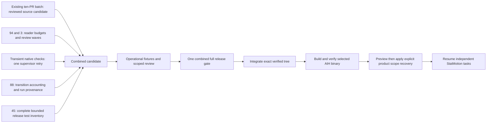

# Bounded throughput improvement pass — 2026-09-26

## Decision and observed baseline

Pause StatMotion admissions while repairing the shared AIH control plane. Keep
its source checkpoints, user edits, and stopped state intact. Resume product work
after this pass is integrated and its public recovery interfaces are verified.
All orchestration changes belong in AIH, not the consuming product.

The stopped StatMotion snapshot (revision 4894) contains seven already-planned
accepted objectives. An additional backlog dispatcher would not unblock them.
The renderer task records 151 provider invocations: 34 implementation runs and
116 specialist/review/guidance runs, plus one advisor invocation. Recorded provider
duration totals 44,590 seconds. This is cumulative provider work, not elapsed
project time: roles can overlap and interrupted runs currently undercount cost.
The observation is evidence of repeated gates, not proof that any individual
review was unnecessary. Do not present these totals as utilization or a delivery ETA.

Existing mechanisms already provide bounded writers, isolated worktrees,
continuous dispatch, accepted-objective backfill, concurrent independent readers,
scope fencing, exact-head evidence reuse, and a merge train. Reuse them.

## Dependency DAG and ownership

The three delegated implementation tasks and the supervisor's release fix use
separate worktrees. They may write concurrently;
heavy validation is serialized through the existing resource model. Native retry
owns check handling, review work owns role dispatch, and metrics owns run-record
creation/completion and transition accounting. Integrate frequently and resolve
shared-file boundaries explicitly. The frozen release candidate is never edited.

## 1. Bounded readers and useful review ordering — issues 94 and 3

Add strict optional planning, preflight, and review time budgets while retaining
the legacy worker budget as the compatibility fallback. Implementation retains
its current soft-deadline checkpoint behavior.

Independent reviewers remain concurrent. QA that evaluates peer artifacts runs
after the other required roles and receives their attributable exact-head results.
Every required acceptance disposition remains mandatory. Neither a failure nor
an authentication error may disappear behind scheduling changes. A reader deadline
must preserve the source and evidence and must not consume a code FIX or Advisor
cycle. Any retry is explicitly bounded; otherwise expose a recoverable blocker.

Acceptance: a fake-provider/real-Git fixture makes QA assert that reviewer and
security artifacts are present; each role runs only as required. A slow reader is
bounded by its configured stage budget while unrelated eligible work can proceed.
Invalid budget values fail policy validation. Existing implementer checkpoint,
authentication, evidence identity, and reuse tests remain valid.

## 2. Transient native failures without code regeneration

Distinguish typed native-check deadlines and narrowly recognized Windows package
installation locks from source failures. Retry once through the existing native
verification queue and heavy permit at the same source/policy/check identity.
Do not invoke an implementer or Advisor and do not consume their retry budgets.
A repeated transient failure preserves diagnostics and blocks for environment
repair with verification-only recovery. Global cancellation never retries.
An assertion/compiler failure retains the existing bounded source FIX path.

Acceptance: timeout and narrowly matched lock fixtures show zero writer/Advisor
invocations and no FIX increment; second failure blocks; changed identity permits
a fresh bounded attempt; near-miss text and actual source failures do not enter
the transient lane. Diagnostics remain bounded and redacted.

## 3. Honest throughput accounting — issue 88

Record source/base/policy/stage identity on new provider runs and finalize duration
on interruption. Account for task-state changes at meaningful state publications,
including direct state assignments. Identical observations must not create new
portable state commits. Expose a read-only human/JSON report distinguishing
provider work, recorded state residence, blockers, and repeated runs at an exact
head. Historical missing measurements are unavailable, not fabricated zeros.
Paused time and operator wait cannot be labeled productive or avoidable idle.

Acceptance: deterministic clocks prove transition accounting and interrupted-run
duration; round-trip/migration preserves legacy snapshots; repeated unchanged-head
review is visible; no-op persistence stays a no-op. Report cumulative provider
seconds separately from elapsed time and do not add overlapping roles into wall time.

## 4. Complete bounded release inventory — issue 45

The frozen `9278fb4` gate failed at the engine package's 900-second aggregate
deadline. It had completed 180 top-level tests, totaling 880.53 recorded seconds,
and was still advancing through scope recovery fixtures. No earlier assertion
failure occurred. This is failed validation, not permission to merge the batch.

Discover all packages and runnable engine tests through Go's native inventory,
then execute every engine test in deterministic serial groups of sixteen. Preserve
uncached execution, fail-fast behavior, fixture deadlines, and each group's
fifteen-minute bound. Require a terminal pass/skip event for every planned test.
Record the complete planned inventory; never imply that unexecuted groups passed.
Tests prove exact-once grouping, rejection of incomplete/unsafe inventories, and
failure when a subprocess exits successfully without covering a planned test.

## Completion gate and resumption

Use focused checks on each changed contract, then scoped independent review. Run
one full uncached combined release gate with vet and cross-builds after operational
fixtures pass. Do not duplicate the full suite per branch. Record exact commit/tree
identities and limitations. Merge normal source history without bypassing fencing
or weakening required evidence. Then build the selected binary, run the read-only
scope recovery preview against current product state, apply through supported AIH
interfaces, and resume dependency-unblocked tasks with the configured safe writers.

Report product throughput as verified merged changes and critical-path age after
resumption. More sessions, open issues, or checkpoint commits are not success.

## Deferred from this finite repair pass

General stack-PR machinery, automatic binary draining, configurable review DAGs,
external shell resource reservation, and a broader task-contract rewrite are not
part of this pass. Broader Windows fixture resource lanes require a demonstrated
fixture-contention failure beyond the observed aggregate timeout. Do not create
more infrastructure simply because an audit proposed it.
The broader [AIH execution architecture proposal](EXECUTION_ARCHITECTURE.md)
addresses accepted-goal preparation, evidence readiness, controlled activation,
and measured scoped reuse after rollout. It preserves existing defaults and is
not a claim that these proposed contracts are already deployed. Product work
resumes alongside subsequent shared improvements after this finite repair.
The existing batch already repairs publication timeout recovery, deadlock,
history-preserving synchronization, focused/shared validation, sealed visual
reattestation, provider-auth handling, and explicit scope/task recovery.

## Integration status and measured fixture repair

The integration branch contains the four throughput lanes and the earlier
reviewed recovery batch. Focused native/metrics fixtures passed together (183.545s),
combined model/config/roles/CLI/release unit checks passed, and the supported
read-only scope preview passed against stopped StatMotion revision 4894.
Final reader fixtures passed; the complete release gate remains required before deployment.

The QA-wave fixture originally used a 45-second wait with two independently
merging tasks. Timeout stacks showed active serialized Git publication, rather
than a mutex cycle. The corrected fixture pins canonical writer/reader capacities,
holds the independent writer active until durable exact-head QA acceptance, and
uses a bounded 90-second observation window with a 120-second worker budget.
It retains peer-artifact and acceptance assertions. The mixed P1/deadline fixture
waits for completed routing instead of failing on a valid intermediate publication.
All failure exits cancel and drain their supervisor before closing its database.

Known limits: this pass does not claim automatic binary draining, automatic scope
reauthorization, or complete issue-94 planning recovery. Reader budgets are optional;
legacy configuration retains its prior worker-budget fallback. Historical pinned
run context and state residence are unavailable where they were never recorded.
Product delivery improvement must be measured after resumption, not inferred from
parallel agent count or these passing infrastructure checks.

## Validation-planning capability repair

The complete gate at `a1ac844` failed in group 6/15 after all non-engine packages
and 78 engine tests passed. `TestMissingNativeCapabilityBlocksWithoutImplementerRetry`
reached its 90-second deadline. Review traced an unavailable native executable
inside validation-plan toolchain discovery: the untyped error bypassed the
execution-time capability blocker and entered ordinary source FIX recovery.
AIH issue 139 records the reproduction, cause, throughput cost and acceptance.

The repair preserves configured-check provenance in a typed planning error and
routes it through the existing verification-only native capability handler.
The real-Git fixture now asserts no code FIX or Advisor and cross-machine blocker
recovery; the focused provenance and missing-tool cases passed together (29.123s).
The repaired candidate still requires the complete uncached gate before deployment.

The next gate at `f5e59bc` was deliberately cancelled after review confirmed a
separate existing capability-continuation fixture used the `aih-state` commit as
its task code baseline. It had reported no assertion failure when cancelled.
The fixture now uses the exact `origin/main` code SHA for `BaseSHA`, retaining the
state SHA only as the state-publication CAS parent. Source ancestry validation is
unchanged. The corrected writer-checkpoint/capability-continuation fixture passed
in isolation (49.271s). A new frozen candidate requires the complete gate; cancelled
or partial runs are not passing release evidence.

StatMotion PR 172 consumes the shared reader-budget interface with 600/300/600
second planning/preflight/review limits and requires schema 11. Its configuration
parsed successfully, and `npm run validate` passed all 227 tests and both builds.
The existing 635kB Studio bundle warning is accepted for that configuration-only
change. An earlier operator-preview port conflict was cleared by stopping the owned
preview before rerunning validation. Activate this policy only after AIH deployment,
then regenerate scope manifests against its new canonical policy hash.

## Remaining diagnostics and provisioned-browser proof

Candidate `65aaeb1` failed in group 9 after 123 engine passes and two explicit
provisioned-browser skips. The read-only isolation fixture still expected Reviewer
and QA to overlap, contrary to the new QA-after-peer ordering. The repair uses
Reviewer and Security as independent readers while preserving the two-reader
capacity, disposable-checkout isolation and cleanup assertions. The shared demo
worker no longer waits for another reader on every QA call; an explicit bounded
Reviewer/Security rendezvous remains only in the demo that tests parallelism.
Independent scoped review approved the fixture-only change. Focused recovery demo
and read-only isolation checks passed (160.268s and 32.320s respectively).

All 88 remaining engine tests then passed in seven serial diagnostic groups at
`48484c`. This includes the failed case and all previously unexecuted tests, not
a substitute for the full release gate. The engine inventory still contains 213
tests; already completed tests must also run in the final uncached gate.

Provisioning the two real-browser cases exposed a separate fixture defect:
`TestNativeVisualCapturePinsHeadAndStoresOutsideSource` constructed its controller
with a zero-value control Git client. Detached checkout creation therefore ran
against the process repository, which did not contain the fixture source SHA.
Production initializes and fetches a control repository; the fixture now creates
that repository and asserts it contains the exact pinned commit. Source/revision,
network-blocking, external artifact storage and capture assertions are unchanged.
Both provisioned real-browser tests passed together (16.814s); scoped review
approved the repair. The final gate enables those tests explicitly so a browser
skip cannot be presented as provisioned-browser proof.

Known boundary: diagnostics, focused proofs and an architecture proposal do not
establish improved consumer delivery. The combined exact-tree release gate,
verified artifact activation and a real task reaching DONE remain required.
